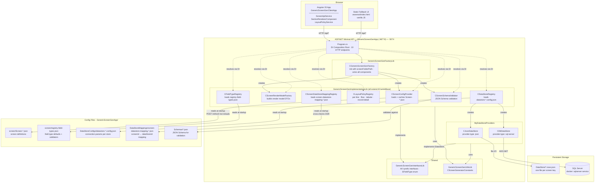

# Architecture Diagram — GenericScreenGenSln

> Mermaid source. Renders in GitHub, VS Code (Markdown Preview), and any Mermaid-aware viewer.
> PlantUML equivalent: `architecture.puml`

```mermaid
flowchart TD
    subgraph Browser["Browser"]
        AngularApp["Angular 20 App\nGenericScreenGenClientApp\n─────────────────────\nScreenApiService\nSectionRendererComponent\nLayoutPolicyService"]
        StaticUI["Static Fallback UI\nwwwroot/index.html\nvanilla JS"]
    end

    subgraph API["ASP.NET Minimal API — GenericScreenGenApp (.NET 8) — :5074"]
        EP["Program.cs\nDI Composition Root · 10 HTTP endpoints"]

        subgraph FactoryPkg["GenericScreenGenFactoryLib"]
            FAC["CGenericScreenGenFactory\ninit with screenFolderPath · wires all components"]
        end

        subgraph ImplsPkg["GenericScreenGenImplementationsLib  (all extend ACanInitBase)"]
            SCP["CScreenConfigProvider\nloads + caches Screen-*.json"]
            SRF["CScreenRenderModelFactory\nbuilds render model DTOs"]
            SSV["CScreenSchemaValidator\nJSON Schema validation"]
            LPR["CLayoutPolicyRegistry\nper-line · flow · tabular · record-detail"]
            FTR["CFieldTypeRegistry\nloads registry-field-types.json"]
            DSR["CDataStoreRegistry\nloads datastore.*.config.json"]
            SDM["CScreenDataStoreMappingRegistry\nloads screen-datastore-mapping.*.json"]
        end

        subgraph ProvidersPkg["MyDataStoreProviders"]
            JSON_DS["CJsonDataStore\nprovider-type: json"]
            SQL_DS["CDbDataStore\nprovider-type: sql-server"]
        end

        subgraph SharedPkg["Shared"]
            INTF["GenericScreenGenInterfacesLib\nAll I-prefix interfaces · EFieldType enum"]
            UTILS["GenericScreenGenUtilsLib\nCScreenGeneratorConstants"]
        end
    end

    subgraph ConfigFiles["Config Files  ·  GenericScreenGenApp/"]
        SC["screen/Screen-*.json\nscreen definitions"]
        FT["screen/registry-field-types.json\nfield type defaults + validators"]
        DC["DataStoreConfigs/datastore.*.config.json\nconnection params per store"]
        DM["DataStoreMappings/screen-datastore-mapping.*.json\nscreenId → dataStoreId mapping"]
        SCH["Schemas/*.json\nJSON Schema for validation"]
    end

    subgraph Storage["Persistent Storage"]
        JFILE["DataStore/*.rows.json\none file per screen key"]
        SQLDB[("SQL Server\ndocker: sqlserver service")]
    end

    AngularApp -- "HTTP /api/*" --> EP
    StaticUI -- "HTTP /api/*" --> EP

    EP --> FAC
    FAC -- "creates" --> SCP & SRF & SSV
    EP -. "resolves via DI" .-> SCP & SRF & SSV & LPR & FTR & DSR & SDM

    SCP -- "reads at startup\nPOST /refresh hot-reloads" --> SC
    FTR -- "reads at startup" --> FT
    SSV -- "validates against" --> SCH
    DSR -- "reads at startup" --> DC
    SDM -- "reads at startup\ncross-checks DSR" --> DM

    DSR -- "creates" --> JSON_DS & SQL_DS
    JSON_DS -- "file I/O" --> JFILE
    SQL_DS -- "ADO.NET" --> SQLDB

    ImplsPkg -- "implements" --> INTF
    ProvidersPkg -- "implements IDataStore" --> INTF
    ImplsPkg & ProvidersPkg -- "uses" --> UTILS
```
