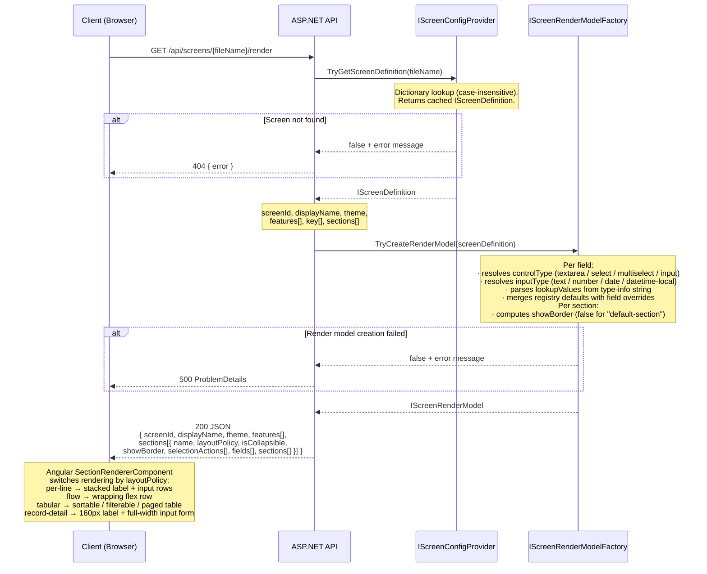
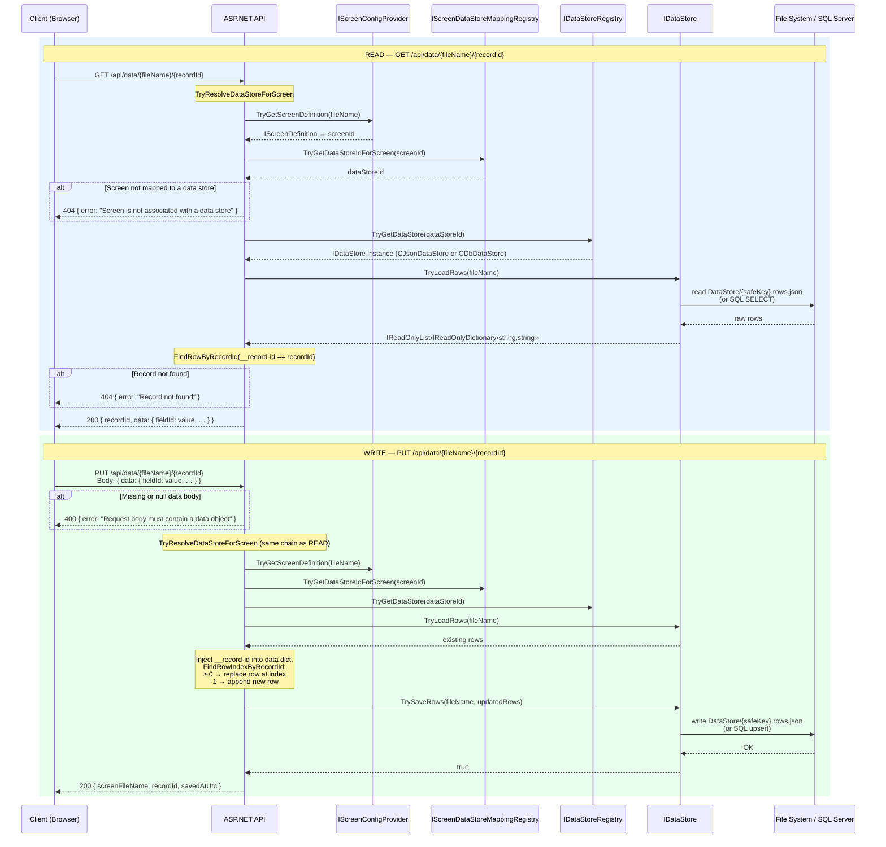

# Sequence Diagrams — GenericScreenGenSln

> Mermaid source. Renders in GitHub, VS Code, and any Mermaid-aware viewer.
> PlantUML equivalents: `sequences.puml`

---

## 1 — Application Startup (DI Wiring)

Shows how `Program.cs` constructs and wires all singleton services at boot time.

```mermaid
sequenceDiagram
    participant P  as Program.cs
    participant FAC as CGenericScreenGenFactory
    participant LPR as CLayoutPolicyRegistry
    participant FTR as CFieldTypeRegistry
    participant SCP as CScreenConfigProvider
    participant SSV as CScreenSchemaValidator
    participant SRF as CScreenRenderModelFactory
    participant DSR as CDataStoreRegistry
    participant SDM as CScreenDataStoreMappingRegistry
    participant FS  as File System

    P->>FAC: new CGenericScreenGenFactory()
    P->>FAC: Init(screenFolderPath)
    Note over FAC: Stores screenFolderPath.<br/>Derives schemaFilePath = .../Schemas/ScreenConfigSchema.json

    P->>LPR: new CLayoutPolicyRegistry()
    Note over LPR: Registers 4 layout policies:<br/>per-line · flow · tabular · record-detail

    P->>FTR: new CFieldTypeRegistry()
    P->>FTR: Init(contentRootPath)
    FTR->>FS: read screen/registry-field-types.json
    FS-->>FTR: field type definitions (id, parameters, validators)

    P->>FAC: TryCreateScreenConfigProvider(lpr, ftr)
    FAC->>SCP: new CScreenConfigProvider(lpr, ftr)
    FAC->>SCP: Init(screenFolderPath)
    SCP->>FS: GetFiles("Screen-*.json")
    FS-->>SCP: screen JSON files
    Note over SCP: Deserialises each file → validates layout<br/>policies + field types → caches IScreenDefinition

    P->>FAC: TryCreateScreenSchemaValidator()
    FAC->>SSV: new CScreenSchemaValidator()
    FAC->>SSV: Init(schemaFilePath)
    SSV->>FS: read Schemas/ScreenConfigSchema.json

    P->>FAC: TryCreateScreenRenderModelFactory()
    FAC->>SRF: new CScreenRenderModelFactory()
    FAC->>SRF: Init("")

    P->>DSR: new CDataStoreRegistry()
    P->>DSR: Init(contentRootPath)
    DSR->>FS: GetFiles("datastore.*.config.json")
    FS-->>DSR: config files (id, provider-type, parameters)
    Note over DSR: Creates CJsonDataStore or CDbDataStore<br/>per config entry; keyed by id

    P->>SDM: new CScreenDataStoreMappingRegistry(dsr)
    P->>SDM: Init(contentRootPath)
    SDM->>FS: GetFiles("screen-datastore-mapping.*.json")
    FS-->>SDM: mapping files (datastore-id, screen-ids[])
    SDM->>DSR: TryGetDataStore(id) — validate each reference
    Note over SDM: Builds screenId → dataStoreId dictionary

    P->>P: app.Build() — DI container sealed
    P->>P: app.Run()  — listening on :5074
```

---

## 2 — Screen Render Request

Shows the flow for `GET /api/screens/{fileName}/render` — the primary endpoint consumed by the Angular client.



---

## 3 — Data Read & Write

Shows the full resolution chain for data endpoints — both `GET` (load record) and `PUT` (upsert record).


